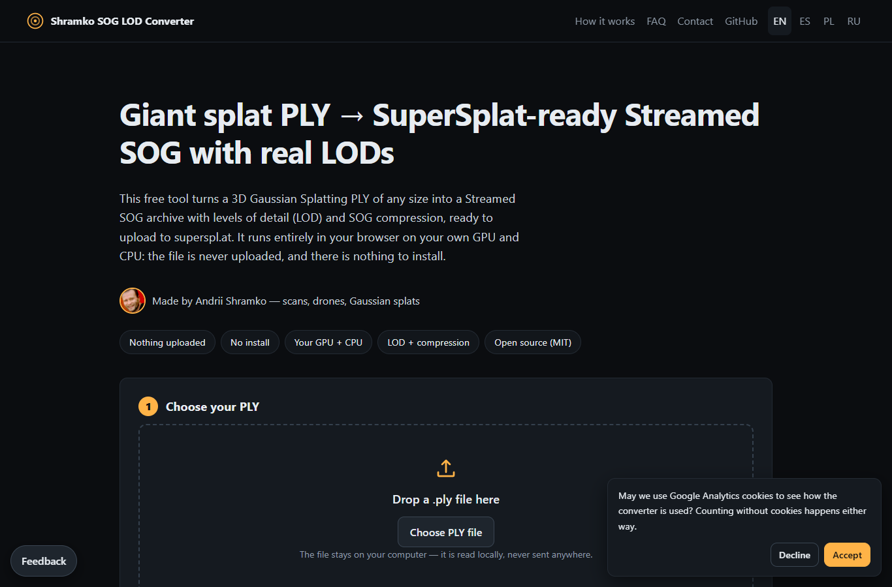
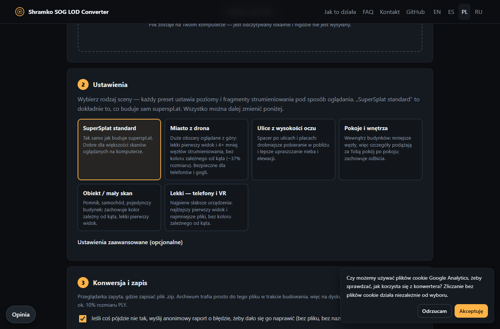

# Shramko SOG LOD Converter — giant PLY → Streamed SOG with real LODs for SuperSplat, in your browser

**Convert huge 3D Gaussian Splatting `.ply` files (hundreds of millions of splats, 10+ GB) into a SuperSplat-ready Streamed SOG `.zip` with real levels of detail (LOD) and SOG compression — on your own GPU and CPU, in the browser. Nothing is uploaded, nothing to install.**

**Live tool:** <https://sog.flyreelstudio.eu> · **Author:** [Andrii Shramko](#author--working-together) · **License:** MIT



> **Status (2 Oct 2026):** live at <https://sog.flyreelstudio.eu>, verified end to end in Chrome (2M and 20M-splat samples, preset runs, error reports, feedback). The full 259M-splat / 17.6 GB run and its upload to superspl.at are being finished today — see *Measured*.

## Why this exists

[superspl.at](https://superspl.at) accepts at most **10 GB per upload**. City-scale drone scans are bigger than that: the test scan for this tool is **258,951,032 splats / 17.6 GB**. SuperSplat streams large scenes as *Streamed SOG* — a `lod-meta.json` spatial tree plus many small SOG chunks at several levels of detail — and it publishes a pre-built Streamed SOG `.zip` exactly as uploaded.

Two problems kept coming up:

1. **The PLY is too big to upload**, and building Streamed SOG yourself means Node.js, the `splat-transform` CLI and a two-step command per level.
2. **"Streamed SOG" built from one PLY without decimated levels has only ONE level.** The scene is cut into chunks, but there is nothing coarser to show — the viewer still has to fetch full detail. (This is exactly the bug that started this project: a hand-made bundle with `lodLevels: 1`.)

This tool fixes both, in a browser tab.

## How it works

1. **Plan the levels like SuperSplat.** Each level keeps half of the previous one until a level holds at most 1,000,000 splats — `1 + ⌈log₂(N / 1M)⌉` levels, the policy superspl.at itself uses when it generates LODs on its servers (10 levels for 259M splats).
2. **Cut the scene into tiles that fit a browser tab.** Chrome caps a single `ArrayBuffer` at ~2 GiB and a tab at ~16 GB (measured in Chrome 154). The scene is split with a k-d tree into spatial tiles sized to the RAM you allow; a few sequential passes over the file load them. Each tile is Z-order (Morton) sorted in memory.
3. **Simplify and compress on your hardware.** For every tile, [PlayCanvas splat-transform](https://github.com/playcanvas/splat-transform) (MIT) decimates (merges neighbouring splats) to build each coarser level — on your GPU via **WebGPU** — and its LOD writer compresses every streaming chunk to **SOG** (quantised attributes in lossless WebP textures, k-means palettes for spherical harmonics).
4. **Stream everything into one archive, then check it.** Chunk files stream straight to disk into a **ZIP64** archive (over 4 GB is normal) with `lod-meta.json` at the root; the tile trees are joined under the same k-d split. When done, the archive is **read back from disk** and verified: every level, every chunk and texture, splat counts, and the file names superspl.at's upload form accepts.

Your file never leaves your computer. The server only delivers the static page (plus a tiny API for feedback and anonymous error reports).

## Use it

1. Open <https://sog.flyreelstudio.eu> in **desktop Chrome or Edge** (WebGPU + saving straight to disk).
2. Drop your `.ply`. The page reads the header instantly and shows the level plan, estimated time and archive size.
3. Keep the defaults (they match SuperSplat) or open **Advanced settings**.
4. Click **Convert**, choose where to save `<name>-SSOG.zip`, keep the tab open. Progress, ETA, the current step and a live log are shown; if something fails, the error and its step are shown and (if you allow) an anonymous report is sent so it can be fixed.
5. Upload the `.zip` at superspl.at → Upload.

## Settings

| Setting | Default | What it does |
|---|---|---|
| Keep per level | 0.5 | Fraction of splats each coarser level keeps (SuperSplat's halving). |
| Stop at | 1,000,000 | No new level once a level holds this many splats or fewer. |
| Max levels | auto (≤ 16) | Upper bound on the number of levels. |
| Simplification | uniform | `adaptive` allocates removal by local error — better on skies / mixed scale, more memory. |
| SH bands | keep | Drop view-dependent colour bands for a smaller archive. |
| SH iterations | 10 | k-means iterations for SH palettes (only with SH > 0). |
| WebP effort | libwebp default | Lossless WebP effort 0–9. |
| Remove NaN/Inf | on | Broken splats would stop the LOD writer. |
| Chunk splats / size / min | 512K / 16 m / 8K | How the scene is cut into streamable chunks (SuperSplat uses the same). |
| RAM to use | 8 GB (auto) | Tile size and number of reading passes follow from it. |
| GPU (WebGPU) | on | ~4× faster decimation than CPU. |
| Encoder threads | auto (≤ 4) | Parallel WebP/SOG encoders. |

## Scene presets

Pick the kind of scene instead of guessing settings. A preset sets only what the **file** controls; the splat budget, LOD distances and penalties belong to the viewer (SuperSplat uses 1M splats on phones and Quest/Pico in XR, 2–4M on desktops).

| Preset | Coarsest level ≤ | Simplification | SH | Chunk K / size / min | Best for |
|---|---|---|---|---|---|
| **SuperSplat standard** | 1,000,000 | uniform | keep | 512 / 16 m / 8 | Same as superspl.at builds itself; desktops |
| **City from a drone** | 250,000 | adaptive | none | 256 / 32 m / 32 | Large areas seen from above, phones and headsets |
| **Streets at eye level** | 500,000 | adaptive | keep | 256 / 16 m / 8 | Walking through streets and squares |
| **Rooms & interiors** | 500,000 | adaptive | keep | 256 / 8 m / 4 | Inside buildings, room by room |
| **Object / small scan** | 500,000 | uniform | keep | 256 / 16 m / 8 | A statue, a car, one building |
| **Light — phones & VR** | 250,000 | adaptive | none | 128 / 16 m / 8 | Weak devices first |



Every level keeps 50% of the previous one in all presets. Why these values (measured 2026-10-02 with the PlayCanvas engine 2.22.6 LOD classes on public superspl.at manifests and on the 259M-splat Lublin scan):

- **The coarsest level is a floor.** The viewer starts every node at its coarsest level and never draws fewer splats than that level's total; SuperSplat downloads all of it before the first frame. With SuperSplat's default (stop at ≤ 1M), the floor is 0.5–1.0M — 50–100% of a phone's or headset's budget, so they can barely refine. Stopping at 250K gives them room and a ~4× lighter first frame (e.g. 9.5 → 2.4 MB without SH). The page shows the floor for your file as a percentage of a 1M budget.
- **Chunk size = download granularity.** A unit file is downloaded whole; at 512K splats per unit the viewer keeps ~8× more splats resident than it draws. 128K units cut resident data by ~58–61%, at 4× more files.
- **Aerial scans: fewer, larger nodes.** In dense drone scans node count is set by `chunkMin`/`chunkExtent`; 32 m / 32K gives 4× fewer nodes (manifest 31 → 7.9 MB, LOD pass ~5× cheaper) with identical views, flying down to street level included.
- **Eye level: 16 m nodes.** 8 m gave no visible gain at 3× the nodes; 32 m made the near field coarser.
- **Adaptive simplification is better on real scans:** level 2 (25% of the splats) rendered against the source from the same camera — **34.4 dB PSNR adaptive vs 28.0 dB uniform** on the Lublin sample. It needs about twice the working memory (more, smaller tiles).
- **Dropping SH** (view-dependent colour) saves ~37% of the archive and removes a colour re-render pass in the viewer; keep it for interiors and objects with reflections.
- **Not changed:** keep-per-level 0.5 (0.6 was worse in every simulated view and +25% data; 0.4's visual quality is not measured yet).


## Measured

| Input | Where | Levels | Time | Archive | Check |
|---|---|---|---|---|---|
| 20,000,000 splats (1.27 GB, SH0) | Chrome 154, RTX 4090, i9-7980XE, 12 GB RAM setting | 6 (20M → 625K) | 8 min 23 s | 465 MB | read-back ✓, `splat-transform --info` ✓ |
| 2,000,000 splats (130 MB, SH0) | same | 2 | 37 s | 36 MB | read-back ✓ |

Round-trip quality on the 2M sample: rendering LOD 0 decoded from the archive vs the source PLY from the same camera — **PSNR 49.9 dB** (negative control: the same render shifted by 40 px — 16.7 dB).

## Comparison (as of 2 October 2026)

| | This converter | superspl.at upload (Auto LODs) | superspl.at/convert | splat-transform CLI |
|---|---|---|---|---|
| Largest input | No fixed limit (tiles); tested on 259M splats / 17.6 GB | 10 GB per upload | What fits in one tab | Your RAM |
| Levels of detail | Yes — halving to ≤ 1M, like SuperSplat | Yes (server side) | No Streamed SOG output | Yes — two manual steps per level |
| Runs on | Your browser (your GPU + CPU) | Their servers | Your browser | Your PC |
| Install | Nothing | Nothing | Nothing | Node.js 22 + npm |
| Output check | Reads the archive back | — | Statistics table | `--info` |

## Questions people ask

**How can I upload a Gaussian splat PLY larger than 10 GB to SuperSplat?**
Convert it here into a Streamed SOG `.zip` (typically 5–10% of the PLY size) and upload the `.zip`. The levels of detail are already inside, so SuperSplat publishes it as-is.

**Is there a way to make Streamed SOG with LODs without installing Node.js?**
Yes — this page runs splat-transform in your browser. Everything happens locally.

**Why does my Streamed SOG have no levels of detail?**
It was built from one PLY without decimated levels: `splat-transform scene.ply lod-meta.json` writes a single level cut into chunks. Check `lodLevels` in `lod-meta.json` — real LODs need it to be > 1. `npx tsx tools/verify-zip.ts your.zip` reports it.

**How many LOD levels should a 3DGS scene have for SuperSplat?**
SuperSplat halves the count per level until a level holds ≤ 1M splats: `1 + ⌈log₂(N / 1M)⌉`. 100M splats → 8 levels; 259M → 10.

**Can I convert a 250-million-splat city scan in a browser?**
Yes — the scene is processed in spatial tiles, so memory stays bounded. It takes hours, not minutes; see *Measured*.

**Is my scan uploaded anywhere?** No. Only optional feedback and anonymous error reports (no file, no file name) reach the server.

**Can I use the result outside SuperSplat?** Yes: unzip it and load `lod-meta.json` with the PlayCanvas engine's LOD streaming, or read it back with splat-transform.

## Status — what works, what's in progress, what's next

**Works (verified):** binary PLY (little/big-endian, SH 0–3) → multi-LOD Streamed SOG `.zip`; spatial tiling beyond one tab's memory; ZIP64 archives > 4 GB (read back by our verifier and by Python `zipfile` with CRC check); WebGPU acceleration in Chrome; read-back verification; live progress with ETA; visible errors and anonymous error reports; feedback (bug / idea / cooperation); 4 languages (EN, ES, PL, RU).

**In progress:** the full 259M-splat / 17.6 GB city scan conversion and its upload to superspl.at (2 Oct 2026).

**Next:** resume after a crash or closed tab · optional direct upload to SuperSplat with your API token · separate sky/environment layer · compressed PLY and SPZ input · processing several tiles in parallel on many-core CPUs.

## Limits and risks

- **Desktop Chrome or Edge recommended.** Firefox/Safari have no save-to-disk API: the archive is built in browser storage (quota-limited) and then downloaded.
- **Long runs.** Hundreds of millions of splats take hours; keep the tab open (a wake lock keeps the PC awake). A closed tab or a crash stops the run; it cannot resume yet.
- **Memory.** A tab can hold about 16 GB. With 16 GB of RAM or less, set *RAM to use* to 4–6 GB.
- **Archive size.** About 12 bytes per splat over all levels for SH0 scans; spherical harmonics add more. Over 10 GB will not upload to superspl.at — drop SH bands.
- **Third-party changes.** superspl.at's upload rules or the Streamed SOG format may change; the tool pins splat-transform 3.8.0. See [`docs/warnings.md`](docs/warnings.md) and [`SECURITY.md`](SECURITY.md).

## Self-host / develop

```bash
git clone https://github.com/AndriiShramko/shramko-sog-lod-converter
cd shramko-sog-lod-converter
npm install          # Node.js 22+
npm run dev          # http://localhost:5180/en/
npm run build        # static site → dist/
```

Tests:

```bash
npx tsx tools/node-convert.ts input.ply out.zip   # the same engine under Node (CPU), then verification
npx tsx tools/verify-zip.ts out.zip               # check any Streamed SOG zip (exit 1 on problems)
npx tsx tools/test-zip64.ts <dir> && python tools/test-zip64.py <dir>   # ZIP64 > 4 GiB, 70k entries
node tools/e2e.mjs input.ply out.zip --mem 12     # real Chrome end to end (Playwright)
python -m unittest discover -s api/tests          # feedback / report API
```

Production runs as two small Docker containers behind nginx-proxy (`deploy/`): `nginx:alpine` for the static site and a stdlib-only Python API for feedback and error reports, with tight memory/CPU limits — the conversion never runs on the server. Runbook: [`deploy/README.md`](deploy/README.md).

Repository layout: `web/src/engine/` (pipeline, tiling, Morton sort, ZIP64 writer, LOD merge, verifier, worker), `web/src/ui/` (page), `api/` (feedback API), `deploy/` (Docker, nginx, deploy/rollback scripts), `tools/` (tests, reports reader). For AI coding agents: [`AGENTS.md`](AGENTS.md), [`AGENT_SETUP.md`](AGENT_SETUP.md), [`SKILL.md`](SKILL.md), [`llms.txt`](llms.txt).

## Author & working together


**Andrii Shramko** — I scan whole cities and buildings as 3D/4D Gaussian splats with drones and 360° cameras, and build tools around them. I made this converter because my own scans (250M+ splats) did not fit SuperSplat's upload and the existing tools didn't build real LODs.

**Open to interesting people and ready to help teams build ambitious projects** — scanning, splat pipelines, viewers, VR, partnerships, licensing or funding. Get in touch:

- 📅 Book a call: <https://calendar.app.google/Ff729HqGk4RpzPNDA>
- 💼 LinkedIn: <https://www.linkedin.com/in/andrii-shramko/>
- ✉️ Email: zmei116@gmail.com
- 🐙 GitHub: <https://github.com/AndriiShramko>

<br clear="left">

## Credits & license

- Conversion core: [@playcanvas/splat-transform](https://github.com/playcanvas/splat-transform) 3.8.0 (MIT) and the [PlayCanvas engine](https://github.com/playcanvas/engine) (MIT) for WebGPU. See [`NOTICE`](NOTICE).
- This project: MIT © 2026 Andrii Shramko. If you use it in research or a product, please credit it — see [`CITATION.cff`](CITATION.cff).
- Independent tool: SuperSplat and PlayCanvas are trademarks of their owners; not affiliated.
